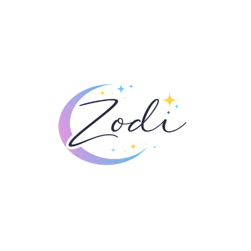

# 🌟 Zodi - AI-Powered Astrology App

<div align="center">



**Yıldızlar senin için konuşuyor ✨**

[](https://flutter.dev)
[](https://dart.dev)
[](https://firebase.google.com)
[](https://ai.google.dev)
[](LICENSE)

[Özellikler](#-özellikler) • [Kurulum](#-kurulum) • [Mimari](#-mimari) • [Ekran Görüntüleri](#-ekran-görüntüleri) • [Katkıda Bulunma](#-katkıda-bulunma)

</div>

---

## 📱 Hakkında

Zodi, Google Gemini AI ile güçlendirilmiş, modern ve kullanıcı dostu bir astroloji uygulamasıdır. Türkçe dilinde, samimi ve dürüst bir yaklaşımla kişiselleştirilmiş astrolojik içerikler sunar.

### 🎯 Temel Özellikler

- **🌙 Günlük Burç Yorumları**: AI destekli, kişiselleştirilmiş günlük fallar
- **🔮 Yükselen Burç Hesaplama**: Swiss Ephemeris ile profesyonel astronomik hesaplamalar
- **🃏 Tarot Falı**: 22 Major Arcana kartı ile günlük ve 3'lü yayılım
- **💑 Uyumluluk Analizi**: Burçlar arası detaylı uyum skorları
- **📊 Detaylı Analizler**: Aşk, kariyer, sağlık, para kategorilerinde derinlemesine yorumlar
- **🌓 Haftalık & Aylık Yorumlar**: Uzun vadeli astrolojik öngörüler
- **💭 Rüya Yorumu**: AI destekli rüya analizi ve sembol yorumlama
- **🔥 Streak Sistemi**: Günlük kullanım takibi ve motivasyon
- **🎨 Tema Özelleştirme**: Karanlık/Aydınlık mod ve özel renkler
- **🔔 Akıllı Bildirimler**: Günlük hatırlatmalar ve özel anlar
- **📈 İstatistikler**: Kullanım geçmişi ve kişisel gelişim takibi

### ✨ Öne Çıkan Teknolojiler

- **Google Gemini AI**: Doğal dil işleme ve içerik üretimi
- **Swiss Ephemeris**: Profesyonel astronomik hesaplamalar
- **Firebase**: Kimlik doğrulama, veritabanı, analytics
- **Flutter**: Cross-platform mobil uygulama geliştirme

---

## 🚀 Kurulum

### Gereksinimler

- Flutter SDK 3.0+
- Dart SDK 3.0+
- Android Studio / Xcode
- Firebase hesabı
- Google Gemini API anahtarı

### Adım Adım Kurulum

1. **Repo'yu klonlayın**
```bash
git clone https://github.com/yourusername/zodi-flutter.git
cd zodi-flutter
```

2. **Bağımlılıkları yükleyin**
```bash
flutter pub get
```

3. **Environment dosyasını oluşturun**
```bash
# .env dosyası oluşturun ve API anahtarınızı ekleyin
echo "GEMINI_API_KEY=your_api_key_here" > .env
```

4. **Firebase'i yapılandırın**
```bash
# Firebase CLI ile projenizi bağlayın
firebase login
flutterfire configure
```

5. **Uygulamayı çalıştırın**
```bash
flutter run
```

### Build Komutları

```bash
# Android APK
flutter build apk --release

# Android App Bundle
flutter build appbundle --release

# iOS
flutter build ios --release
```

---

## 🏗️ Mimari

### Proje Yapısı

```
lib/
├── constants/          # Sabitler ve yapılandırmalar
│   ├── colors.dart
│   ├── strings.dart
│   └── tarot_data.dart
├── models/            # Veri modelleri
│   ├── zodiac_sign.dart
│   ├── daily_horoscope.dart
│   ├── tarot_card.dart
│   └── user_profile.dart
├── providers/         # State management (Provider pattern)
│   ├── auth_provider.dart
│   ├── theme_provider.dart
│   └── horoscope_provider.dart
├── screens/           # Ekranlar
│   ├── splash_screen.dart
│   ├── welcome_screen.dart
│   ├── home_screen.dart
│   ├── daily_screen.dart
│   ├── tarot_screen.dart
│   ├── rising_sign_screen.dart
│   └── ...
├── services/          # İş mantığı ve API çağrıları
│   ├── gemini_service.dart
│   ├── astronomy_service.dart
│   ├── firebase_service.dart
│   ├── notification_service.dart
│   └── ...
├── widgets/           # Yeniden kullanılabilir bileşenler
│   ├── animated_card.dart
│   ├── tarot_card_widget.dart
│   ├── premium_lock_overlay.dart
│   └── ...
└── main.dart          # Uygulama giriş noktası
```

### State Management

**Provider Pattern** kullanılarak üç ana provider:
- `AuthProvider`: Kullanıcı kimlik doğrulama ve profil
- `ThemeProvider`: Tema yönetimi
- `HoroscopeProvider`: Astroloji verileri

### Veri Akışı

```
User Input → Provider → Service → API/Database
                ↓
            UI Update (notifyListeners)
```

---

## 🎨 Ekran Görüntüleri

<div align="center">

| Splash | Onboarding | Burç Seçimi |
|--------|-----------|-------------|
|  |  |  |

| Ana Sayfa | Günlük Fal | Tarot |
|-----------|-----------|-------|
|  |  |  |

| Yükselen Burç | Uyumluluk | Ayarlar |
|---------------|-----------|---------|
|  |  |  |

</div>

---

## 🔧 Teknoloji Stack

### Core
- **Flutter 3.0+**: UI framework
- **Dart 3.0+**: Programming language
- **Provider 6.1+**: State management

### AI & Astronomy
- **Google Gemini AI 0.4+**: Content generation
- **Swiss Ephemeris 2.10+**: Astronomical calculations

### Backend & Services
- **Firebase Core 3.8+**: Backend infrastructure
- **Firebase Auth 5.3+**: Authentication
- **Cloud Firestore 5.5+**: Database
- **Firebase Analytics 11.3+**: Analytics
- **Firebase Crashlytics 4.1+**: Crash reporting
- **Firebase Storage 12.3+**: File storage

### UI & UX
- **Flutter Animate 4.5+**: Animations
- **Shimmer 3.0+**: Loading effects
- **Lottie 3.1+**: Vector animations
- **Confetti 0.7+**: Celebration effects

### Utilities
- **Shared Preferences 2.2+**: Local storage
- **Flutter Local Notifications 18.0+**: Push notifications
- **Share Plus 10.1+**: Social sharing
- **Google Sign In 6.2+**: OAuth authentication
- **Intl 0.20+**: Internationalization

---

## 📚 Dokümantasyon

Detaylı dokümantasyon için `docs/` klasörüne bakın:

- [Firebase Kurulumu](docs/FIREBASE_SETUP.md)
- [Gemini AI Entegrasyonu](docs/GEMINI_INTEGRATION.md)
- [Yükselen Burç Hesaplama](docs/RISING_SIGN_CALCULATION.md)
- [Tarot Sistemi](docs/TAROT_SYSTEM.md)
- [Bildirim Sistemi](docs/NOTIFICATION_SYSTEM.md)
- [Tema Özelleştirme](docs/THEME_CUSTOMIZATION.md)

---

## 🧪 Test

```bash
# Tüm testleri çalıştır
flutter test

# Belirli bir test dosyası
flutter test test/services/gemini_service_test.dart

# Coverage raporu
flutter test --coverage
```

---

## 🤝 Katkıda Bulunma

Katkılarınızı bekliyoruz! Lütfen şu adımları izleyin:

1. Fork edin
2. Feature branch oluşturun (`git checkout -b feature/amazing-feature`)
3. Değişikliklerinizi commit edin (`git commit -m 'feat: Add amazing feature'`)
4. Branch'inizi push edin (`git push origin feature/amazing-feature`)
5. Pull Request açın

### Commit Mesaj Formatı

```
feat: Yeni özellik ekleme
fix: Bug düzeltme
docs: Dokümantasyon değişikliği
style: Kod formatı değişikliği
refactor: Kod yeniden yapılandırma
test: Test ekleme/düzeltme
chore: Build/config değişiklikleri
```

---

## 📄 Lisans

Bu proje özel lisans altındadır. Detaylar için [LICENSE](LICENSE) dosyasına bakın.

---

## 👥 Ekip

- **Geliştirici**: [Your Name]
- **Tasarım**: [Designer Name]
- **AI Integration**: Google Gemini
- **Astronomical Calculations**: Swiss Ephemeris

---

## 🙏 Teşekkürler

- [Flutter Team](https://flutter.dev) - Harika framework için
- [Google Gemini](https://ai.google.dev) - AI desteği için
- [Swiss Ephemeris](https://www.astro.com/swisseph/) - Astronomik hesaplamalar için
- [Firebase](https://firebase.google.com) - Backend altyapısı için

---

## 📞 İletişim

- **Email**: contact@zodi.app
- **Website**: https://zodi.app
- **Twitter**: [@ZodiApp](https://twitter.com/ZodiApp)
- **Instagram**: [@zodi.app](https://instagram.com/zodi.app)

---

<div align="center">

**Yıldızlar senin için konuşuyor ✨**

Made with ❤️ in Turkey

</div>
